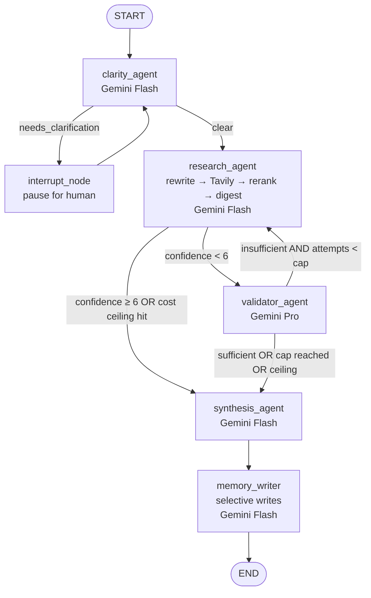

# LangGraph Multi-Agent Research Assistant

A production-shaped LangGraph agent that helps users gather information about
public companies. Four specialized agents (Clarity → Research → Validator →
Synthesis) collaborate via conditional routing, with human-in-the-loop
clarification for ambiguous queries and a validator-driven retry loop for
low-confidence research. Built to satisfy a take-home spec, then layered
with four bonus tiers — observability, retrieval quality, evaluation, and
cross-thread long-term memory.

The system is async-first (Python 3.11+), uses Pydantic v2 at every
boundary, persists short-term state in an `AsyncSqliteSaver` checkpointer
keyed by `thread_id`, and keeps long-term per-user facts in a sqlite-vec
store keyed by `user_id`. Live web search is via Tavily; LLM calls go
through Gemini (Flash for routine work, Pro for judgment-heavy steps).
Observability is delivered via LangSmith (cloud trace tree) plus
OpenTelemetry spans on every node — no extra database container needed.

---

## Architecture



**Key invariants:**
- Every cap (research attempts, cost ceiling, tool calls) has exactly one
  enforcement site in `src/graph/routing.py`. Constants live in
  `src/config.py`.
- Routing functions are pure — no LLM, no I/O. They read state and return
  the next node name as a string.
- `total_cost_usd` accumulates across the run; `route_after_research` and
  `route_after_validator` short-circuit to synthesis when the per-run
  ceiling is hit so the user always gets an answer instead of a stall.

---

## Run instructions

### Prerequisites
- Python 3.11 or 3.12 (3.13 is unsupported because of langgraph deps)
- [`uv`](https://github.com/astral-sh/uv) for package management
- A Gemini API key (`https://aistudio.google.com/apikey`) — required
- A Tavily API key (`https://tavily.com`) — required for live search; the
  system falls back to mock data if absent
- A LangSmith API key (`https://smith.langchain.com`) — optional, traces
  light up automatically when set
- **No Docker / external databases needed.** State persistence uses
  embedded SQLite (`data/checkpoints.db` for short-term, `data/longterm_memory.db`
  for cross-thread user facts).

### Setup

```bash
git clone <your-repo-url>
cd "Research Assistant"
cp .env.example .env
# edit .env — at minimum set GOOGLE_API_KEY and TAVILY_API_KEY
uv sync --extra dev
```

Run the unit test suite to confirm the wiring:

```bash
uv run pytest tests/ --ignore=tests/eval -q
```

You should see **57 passed**.

### Talk to the assistant — Streamlit demo (recommended)

```bash
uv run streamlit run streamlit_app/app.py --server.fileWatcherType=none
```

Opens at `http://localhost:8501`. Seven tabs cover the full feature set:

- **💬 Chat** — multi-turn REPL; per-node `st.status` blocks light up live
  as each agent runs (latency, cost, tokens, key state changes visible).
  Interrupt-resume cycle uses an inline clarification form.
- **📊 Pipeline Trace** — the last run's full audit log + per-node
  cost/latency breakdown chart.
- **🔎 Retrieval Lens** — Tier 2 deep-dive: type any query, see the
  rewritten query, raw Tavily hits, and reranked top-K side by side
  (with arrows showing position deltas after rerank).
- **🧠 Memory** — Tier 4 inspection: switch user_id, list stored facts,
  test retrieval, manually seed a fact for cross-thread demo.
- **🧪 Eval Console** — Tier 3: run a single golden case live (~30s)
  with the metric table filling in as judges respond, OR view the
  persisted `last_run.json` from the most recent full suite run.
- **⚙️ Settings** — runtime-toggle every config knob (rerank on/off,
  cost ceiling, retry cap, model picker). Includes an **A/B compare**
  widget that re-runs your last query against current settings and
  shows old vs new answers + costs side by side.
- **🏗️ Architecture** — static reference: mermaid graph diagram, state
  schema table, routing rules, saved transcripts.

`--server.fileWatcherType=none` matters during a demo: without it,
saving any file in `src/` reloads Streamlit and tears down the cached
graph + checkpointer (~5s of demo time wasted).

### Talk to the assistant — CLI

```bash
uv run python scripts/cli.py
```

The startup banner shows which backends are active. Type questions; type
`exit` or `quit` to leave. Multi-turn memory is automatic per session —
clarification asks pause the graph and resume cleanly with whatever you
type. Same graph as the Streamlit app; useful when you want a terminal
session without the UI.

### Reproduce the two example runs

```bash
uv run python examples/conversation_runs.py
```

Writes `examples/run_1.txt` and `examples/run_2.txt`. Transcripts are
checked into the repo so reviewers can read them without setup.

### Run the eval suite (Tier 3)

```bash
uv run python -m tests.eval.run_eval
```

Forces `RESEARCH_BACKEND=mock` for determinism. Runs all 8 golden cases,
scores them across 4 RAGAS-style metrics + a trajectory judge, prints a
per-case + aggregate table. Takes ~5–6 minutes (live LLM calls).

### Demo cross-thread long-term memory (Tier 4)

```bash
uv run python examples/memory_demo.py
```

---

## Example runs

Both transcripts live in [`examples/`](./examples/) — `run_1.txt` and
`run_2.txt`. Highlights:

**Run 1** — Clear query about Apple. The assistant resolves the company,
calls Tavily, the cross-encoder reranks 8 hits down to 5, the digest comes
back at confidence 9, validator is skipped, synthesis ships. Total cost:
~$0.005, ~13 seconds.

**Run 2** — Two-turn conversation:
- Turn 1: *"How is the company doing?"* (ambiguous) → clarity routes to
  the interrupt node → user replies *"Tesla"* → graph resumes → research
  → synthesis.
- Turn 2: *"What about their CEO?"* (vague follow-up). The query rewriter
  resolves *their* → Tesla using conversation history (rewritten query:
  `"Tesla CEO Elon Musk leadership"`), retrieval surfaces Musk
  compensation news, synthesis answers about Elon Musk. Same `thread_id`
  carries the conversation forward.

---

## State schema

`ResearchState` (in [`src/graph/state.py`](./src/graph/state.py)) is the
Pydantic v2 model LangGraph passes between nodes:

| Field | Type | Reducer | Purpose |
|---|---|---|---|
| `run_id` | `str` | replace | UUID for this run; threads through audit. |
| `user_query` | `str` | replace | Current turn's user input. |
| `clarity_status` | `Literal["clear","needs_clarification"] \| None` | replace | Set by clarity_agent. |
| `clarification_request` | `str \| None` | replace | The question to ask the human. |
| `clarification_response` | `str \| None` | replace | What the human typed back. |
| `company` | `str \| None` | replace | Canonical company name. |
| `research_findings` | `dict \| None` | replace | Recent news / stock / developments. |
| `confidence_score` | `float \| None` | replace | 0–10 from research_agent. |
| `research_attempts` | `int` | replace | Counter for the cap. |
| `validation_result` | `Literal["sufficient","insufficient"] \| None` | replace | From validator_agent. |
| `validation_notes` | `list[str]` | replace | What to fix on the next attempt. |
| `final_answer` | `str \| None` | replace | The user-facing answer. |
| `total_cost_usd` | `float` | **replace-on-update** | Each LLM-using node returns `state.total_cost_usd + cost`. |
| `audit_log` | `list[dict]` | **add (append)** | Per-node breadcrumbs accumulated across the run. |
| `messages` | `list[BaseMessage]` | **add_messages** | Conversation history; persisted by checkpointer for multi-turn. |

The two reducer-typed fields (`audit_log`, `messages`) accumulate across
nodes; everything else is overwritten by the node's return dict.

---

## Routing logic

Three pure functions in [`src/graph/routing.py`](./src/graph/routing.py)
own all routing decisions:

1. **`route_after_clarity(state)`** → `interrupt_node` if
   `clarity_status == "needs_clarification"`, else `research_agent`.
2. **`route_after_research(state)`** → `synthesis_agent` if cost ceiling
   hit OR `confidence_score ≥ 6`, else `validator_agent`.
3. **`route_after_validator(state)`** → `synthesis_agent` if
   `validation_result == "sufficient"` OR `research_attempts ≥ cap` OR
   cost ceiling hit, else `research_agent`.

A grep for `MAX_RESEARCH_ATTEMPTS` finds it twice (definition in
`config.py`, enforcement in routing). Same for `COST_CEILING_PER_RUN_USD`.

---

## Reasonable assumptions

The brief leaves several things underspecified. The decisions made:

- **Live retrieval over mock.** The brief says mock data is acceptable; I
  built against Tavily live search for a stronger demo and kept mock as a
  fallback (used by the eval suite for determinism).
- **Confidence threshold = 6.** "≥ 6" routes to synthesis per the brief;
  "< 6" routes to validator. Equality counts as "high enough" — verified
  by `test_research_at_threshold_skips_validator`.
- **`MAX_RESEARCH_ATTEMPTS = 3`.** Per the brief's "loop back if
  insufficient AND attempts < 3". The validator can ask for two retries
  before the cap fires.
- **Single `thread_id` per CLI session.** Multi-turn carries because the
  same checkpointer thread is reused across REPL iterations. Per-turn
  fields (attempts, validation, answer) are reset in the runner so the
  cap doesn't fire prematurely on a long conversation.
- **`user_id` defaults to `"anonymous"`** for long-term memory when not
  set in `config["configurable"]["user_id"]`. The CLI doesn't yet ask
  for an identity; the demo script (`examples/memory_demo.py`)
  hardcodes `"alice"`.
- **Stub findings vs hallucinations.** When Tavily / mock returns zero
  hits, research_agent emits a sentinel `ResearchFindings` with
  `confidence_score=1.0` (CLAUDE.md pattern: never `None`). The
  validator's stop-retry rule then routes to synthesis instead of
  retrying — looping retries against an unknown company can't help.
- **Selective long-term writes.** The memory writer is a single Flash
  call that asks "is there a durable user preference here?" — most turns
  produce zero facts. Returning empty is the expected outcome, not a
  failure.

---

## Beyond Expected Deliverable

Each tier was added incrementally on top of the spec. Every tier ships
with tests and a live verification.

### Tier 1 — Observability (Phase 8)

- **LangSmith** auto-traces every chain when `LANGSMITH_API_KEY` is set
  in `.env`. The CLI banner prints `LangSmith: enabled` when it picks
  up the key. Traces include the full prompt, response, latency, and
  cost per node, with the interrupt event visibly paused/resumed.
- **OpenTelemetry** spans on every node carry `latency_ms`, `cost_usd`,
  `input_tokens`, `output_tokens`, `model`. Default exporter is the
  console (stdout); flip `OTEL_EXPORTER_OTLP_ENDPOINT` to ship to a
  real collector with no code change.
- **Per-run cost ceiling**. `COST_CEILING_PER_RUN_USD` (default $0.10)
  is enforced once in `route_after_research` / `route_after_validator`.
  When tripped, routing diverts to synthesis so the user always gets an
  answer.
- **Pricing snapshot** in `src/llm/client.py::PRICING_USD_PER_M_TOKENS`
  with a "last verified" date. Unknown models report `$0.0` so a flat
  `$0` audit row is the visible signal to update it.

### Tier 2 — Retrieval quality (Phase 9)

The Research Agent runs a 3-stage retrieval funnel instead of feeding raw
search hits to the LLM:

1. **Query rewriting** (1 Flash call). Resolves pronouns and adds topic
   terms using conversation history — turns *"What about their CEO?"*
   into `"Tesla CEO Elon Musk leadership"` so retrieval works on
   follow-ups.
2. **Tavily over-fetch** (`TAVILY_MAX_RESULTS=8`).
3. **Cross-encoder rerank** with `flashrank` (ONNX runtime,
   ~30MB model). Re-scores hits against the rewritten query and trims
   to top-K (`RERANK_TOP_K=5`). I picked `flashrank` over the plan's
   `sentence-transformers` because it ships without PyTorch — same
   model family (ms-marco MiniLM cross-encoders), ~60MB total install
   instead of 500MB+ on Windows.

Each stage is independently togglable via settings flags so you can A/B
the funnel without touching agent code.

### Tier 3 — Evaluation (Phase 10)

A golden dataset of 8 cases covers every behavior the system needs to
handle: clear queries, ticker resolution, ambiguous-with-clarification,
multi-turn follow-ups, unknown companies. Each case declares its
expectations; failures point at *which* dimension regressed:

- **`context_recall`** (deterministic) — did retrieval surface the
  expected company?
- **`context_precision`** (deterministic) — fraction of top-K hits that
  are on-topic.
- **`faithfulness`** (LLM-as-judge, Pro) — does the answer fabricate
  facts beyond the research findings?
- **`answer_relevance`** (LLM-as-judge, Pro) — does the answer address
  the user's actual question? Takes prior turns into account so
  follow-up pronouns score fairly.
- **`trajectory_score`** (LLM-as-judge, Pro) — judges the whole run:
  clarity correctness, retry effectiveness, efficiency, grounding.
  Decoupled from RAGAS so a regression in either pinpoints a
  different fix path.

Run via `uv run python -m tests.eval.run_eval`. Persists
`tests/eval/last_run.json` for diffing across runs. Exit code 0 if all
cases pass — wire it into CI when you want a gate.

### Tier 4 — Long-term memory (Phase 11)

Short-term memory is the LangGraph checkpointer (per-thread).
**Long-term** memory is a per-user fact store across threads:

- Backend: SQLite + `sqlite-vec`. 768-dim embeddings via the existing
  Gemini embedder. The plan called for pgvector; sqlite-vec is the
  same shape with zero config and no Docker. Pgvector is the
  production swap.
- **Selective writes**: a `memory_writer` node runs after synthesis and
  asks Flash whether the conversation revealed any *durable* user
  preferences. Most turns return an empty list — that's correct.
- **On-demand retrieval**: `research_agent` fetches the top-3 most
  relevant facts (cosine similarity scoped to `user_id`) before its
  digest prompt and injects them.
- **Demo**: `examples/memory_demo.py` runs Session A (different
  `thread_id`, sets a preference) then Session B (different
  `thread_id`, same `user_id`). Audit shows
  `memory_facts_retrieved=2` in B without B ever seeing A's transcript.

---

## Why these choices

A boilerplate scaffold ([`langgraph-agent-boilerplate`](https://github.com/MisterArbazzz/langgraph-agent-boilerplate))
provided the generic infrastructure: LLM client with retry/timeout, OTel
+ LangSmith plumbing, FastAPI + SSE, conftest fixtures, and a
`CLAUDE.md` documenting 10 hard-won patterns from previous production
builds. This let the implementation focus on the use-case-specific code —
state schema, agent prompts, routing, retrieval pipeline, memory — while
inheriting the production-shaped error handling, structured-output
parsing, and observability conventions for free. The boilerplate's Neo4j
audit graph was stripped because LangSmith's trace tree + the in-memory
`state.audit_log` already cover the observability story for this use
case; Neo4j would shine if the data model needed graph queries (company
relationships, citation graphs), which isn't in scope here.

The patterns that mattered most:

- **`ainvoke_structured`** is the only LLM entry point in nodes — it
  handles the `parsed=None` gotcha that would otherwise blow up node
  code with a `'NoneType' has no attribute X`.
- **No `max_length`** on LLM-output Pydantic schemas — Gemini doesn't
  honor schema-level length caps. Length goes in the prompt; schemas
  validate structure (types, required fields, value ranges).
- **Sentinel-not-None** when a lookup misses (research_agent emits a
  stub finding rather than `None`) — prevents the routing from looping
  on the same node forever.
- **HTTP-status-code retry predicates** rather than class predicates —
  the `google-genai` and `google-api-core` SDKs raise different
  exception classes for the same HTTP status; checking codes is what
  works across both.

---

## Project layout

```
.
├── src/
│   ├── adapters/
│   │   └── tavily.py              # live + mock backend, port-adapter pattern
│   ├── graph/
│   │   ├── builder.py             # StateGraph wiring
│   │   ├── routing.py             # 3 pure routing fns + cost ceiling guard
│   │   ├── state.py               # ResearchState + structured-output sub-models
│   │   ├── prompts.py             # system prompt builders
│   │   └── nodes/
│   │       ├── clarity_agent.py
│   │       ├── interrupt_node.py
│   │       ├── research_agent.py  # rewrite → search → rerank → digest
│   │       ├── validator_agent.py
│   │       ├── synthesis_agent.py
│   │       └── memory_writer.py   # selective long-term writes
│   ├── retrieval/
│   │   ├── query_rewriting.py
│   │   └── rerank.py              # flashrank cross-encoder
│   ├── memory/
│   │   └── longterm.py            # sqlite-vec store
│   ├── llm/
│   │   ├── client.py              # tenacity-wrapped Gemini factory + cost
│   │   └── embeddings.py
│   ├── config.py                  # Pydantic Settings — single env-reading site
│   ├── observability.py           # LangSmith + OTel bootstrap
│   ├── logging_config.py
│   └── server.py                  # FastAPI app + lifespan (optional surface)
├── streamlit_app/                 # Interactive demo UI (Tier 0–4 showcase)
│   ├── app.py                     # entry point, tab dispatch, sidebar
│   ├── state.py                   # persistent event loop + cached graph
│   ├── graph_runner.py            # astream wrapper for live UI updates
│   ├── components.py              # shared widgets
│   └── pages/                     # one file per tab
├── tests/
│   ├── eval/                      # Tier 3: golden dataset + run_eval
│   ├── test_state.py
│   ├── test_routing.py
│   ├── test_graph_compile.py
│   ├── test_tavily.py
│   ├── test_retrieval.py
│   ├── test_memory.py
│   ├── test_eval_metrics.py
│   ├── test_mock_data.py
│   └── test_smoke.py
├── examples/
│   ├── conversation_runs.py       # scripted demo, writes run_1.txt + run_2.txt
│   ├── memory_demo.py             # cross-thread memory demo
│   ├── run_1.txt
│   └── run_2.txt
├── scripts/
│   └── cli.py                     # interactive REPL
├── data/
│   ├── mock_companies.py          # 6 companies + alias normalization
│   ├── checkpoints.db             # AsyncSqliteSaver thread state (gitignored)
│   └── longterm_memory.db         # sqlite-vec user facts (gitignored)
├── .env.example
├── pyproject.toml
└── CLAUDE.md                      # repo conventions + hard-won patterns
```

---

## Key configuration knobs

All in `.env` (or `src/config.py` defaults).

| Variable | Default | Effect |
|---|---|---|
| `GOOGLE_API_KEY` | (required) | Gemini auth. |
| `TAVILY_API_KEY` | (optional) | Live search; falls back to mock when absent. |
| `MODEL_PRIMARY` | `gemini-2.5-flash` | Clarity/research/synthesis/memory_writer. |
| `MODEL_QA` | `gemini-2.5-pro` | Validator + judges. |
| `MAX_RESEARCH_ATTEMPTS` | `3` | Validator → research retry cap. |
| `COST_CEILING_PER_RUN_USD` | `0.10` | Hard cap; routes to synthesis when hit. |
| `RESEARCH_BACKEND` | `tavily` | `tavily` or `mock`. |
| `TAVILY_MAX_RESULTS` | `8` | Over-fetch for rerank. |
| `RERANK_ENABLED` | `true` | Cross-encoder rerank. |
| `RERANK_TOP_K` | `5` | Top-K after rerank. |
| `QUERY_REWRITE_ENABLED` | `true` | Conversational → search query rewriter. |
| `LONGTERM_MEMORY_ENABLED` | `true` | Cross-thread per-user facts. |
| `LONGTERM_MEMORY_TOP_K` | `3` | Facts pulled into research_agent prompt. |
| `LANGSMITH_API_KEY` | (optional) | Activates LangSmith tracing. |
| `LANGSMITH_PROJECT` | `research-assistant` | Project name in LangSmith UI. |

---

## License

MIT.
